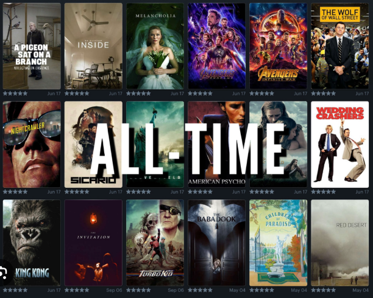
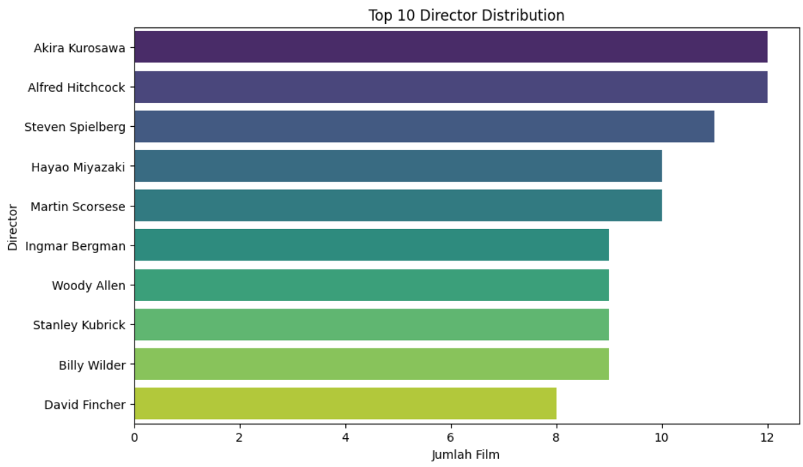
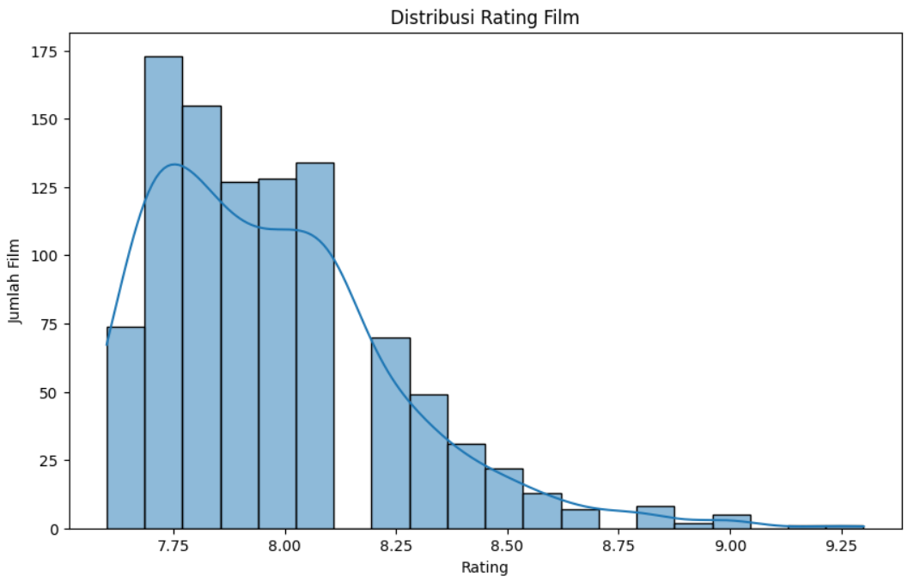

# Laporan Proyek Sistem Rekomendasi Film - Nadila Agustiani Farhan

## Project Overview



Industri film terus saat ini terus berkembang pesat, ditandai dengan jumlah produksi film yang semakin banyak dari tahun ke tahun. Berbagai genre film diproduksi untuk menjangkau minat penonton yang sangat beragam. Berdasarkan hasil penelitian Muhammad Fajriansyah, 2021 [^1], pada tahun 2018 jumlah penonton bioskop di Indonesia telah mencapai lebih dari 50 juta orang, dengan jumlah produksi film — baik film dalam negeri maupun luar negeri — mencapai lebih dari 200 judul yang telah tayang di seluruh Indonesia.
Seiring berkembangnya teknologi digital, kebiasaan menonton film juga telah berubah. Kini, menonton film tidak lagi terbatas pada bioskop. Penonton dapat menikmati berbagai judul film di mana saja dan kapan saja melalui platform streaming digital [^2]. Platform ini menawarkan ribuan pilihan judul film dari berbagai genre dan negara.
Namun, banyaknya pilihan film seringkali membuat penonton kesulitan dalam menentukan film yang sesuai dengan preferensi mereka. Oleh karena itu, sistem rekomendasi menjadi solusi penting untuk membantu pengguna dalam memilih film yang relevan. Dengan adanya sistem ini, penonton dapat menghemat waktu dalam memilih film, sehingga pengalaman menonton menjadi lebih menyenangkan. Dengan demikian, dalam proyek ini, dikembangkan sistem rekomendasi berbasis **Content-Based Filtering** yang memanfaatkan informasi konten film seperti genre dan sutradara untuk menghasilkan rekomendasi yang relevan. Metode ini terbukti efektif dalam beberapa penelitian sebelumnya, termasuk dalam sistem rekomendasi musik oleh Putra dan Santika (2020)[^2].

## Business Understanding

### Problem Statements

1. Bagaimana membantu pengguna menemukan film yang sesuai dengan preferensi mereka?
2. Bagaimana merancang sistem rekomendasi tanpa data interaksi pengguna (seperti rating atau ulasan)?

### Goals

1. Membangun sistem yang dapat memberikan rekomendasi film secara otomatis berdasarkan konten.
2. Menyajikan film serupa berdasarkan fitur seperti genre dan sutradara, tanpa bergantung pada data eksplisit pengguna.

### Solution statements

- Untuk menjawab tantangan tersebut, solusi yang dapat dilakukan adalah membangun sistem rekomendasi film menggunakan pendekatan **Conten-Based-Filtering**. Metode ini mengukur kesamaan antar film menggunakan **cosine similarity** terhadap fitur seperti genre dan sutradara. Sistem ini cocok untuk kondisi cold-start, yaitu ketika tidak tersedia data interaksi pengguna. Dengan demikian, sistem tetap mampu memberikan rekomendasi yang relevan dan personal meskipun tanpa data historis pengguna, sehingga tetap mendukung pengalaman pengguna yang optimal.

## Data Understanding

Dataset yang digunakan dalam proyek ini berisi informasi mengenai judul film, genre, sutradara, dan beberapa data pendukung lainnya. Dataset tersebut diperoleh dari platform Kaggle. 
Sumber dataset: [Dataset](https://www.kaggle.com/datasets/arthurchongg/imdb-top-1000-movies) - Kaggle

Variabel-variabel pada IMDB-Movie dataset adalah sebagai berikut:

- Title : Judul film
- Tirector : Nama sutradara yang mengarahkan film. 
- Release_year : Tahun rilis film.
- Runtime : Durasi film, disimpan dalam bentuk teks seperti "142 min".
- Genre : Genre film, bisa terdiri dari satu atau lebih genre yang dipisahkan koma.
- Rating : Rating film berdasarkan penilaian pengguna (skala 1–10).
- Metascore : Skor film dari kritikus (skala 0–100).
- Gross : Pendapatan kotor film, dalam format string (contoh: "$28.34M").

### Melihat informasi data

```sh
<class 'pandas.core.frame.DataFrame'>
RangeIndex: 1000 entries, 0 to 999
Data columns (total 8 columns):
 #   Column        Non-Null Count  Dtype
---  ------        --------------  -----
 0   title         1000 non-null   object
 1   director      1000 non-null   object
 2   release_year  1000 non-null   object
 3   runtime       1000 non-null   object
 4   genre         1000 non-null   object
 5   rating        1000 non-null   float64
 6   metascore     1000 non-null   int64
 7   gross         1000 non-null   object
dtypes: float64(1), int64(1), object(6)
memory usage: 62.6+ KB
```

> Note:
> Dataset yang digunakan dalam proyek ini terdiri dari 1000 baris data dan 8 kolom fitur yang masing-masing merepresentasikan informasi terkait film, seperti judul, sutradara, genre, rating, hingga pendapatan kotor.

### Memeriksa missing value dan duplikasi
Untuk memastikan bahwa data yang digunakan bersih dari missing value (data yang hilang) maupun duplikasi, dilakukan pemeriksaan menggunakan kode berikut:
```sh
print("Jumlah missing value:", mv_df.isna().sum().sum())
print("Jumlah duplikasi data:", mv_df.duplicated().sum())
```
> Hasil pemeriksaan menunjukkan bahwa dataset tidak memiliki data yang hilang maupun duplikat:

```sh
Jumlah missing value: 0
Jumlah duplikasi data: 0 
```
> Dengan demikian, tidak diperlukan proses tambahan untuk penanganan data hilang atau penghapusan data ganda.
> 
### Melihat Statistik Deskriptif

Untuk melihat statistik deskriptif data film digunakan perintah berikut:
```sh
mv_df.describe()
```
Hasilnya akan menampilkan ringkasan statistik untuk kolom numerik dalam dataset, seperti berikut:
```sh
      rating	metascore
count	1000.00000	1000.000000
mean	7.96870	66.653000
std	0.27562	30.712829
min	7.60000	0.000000
25%	7.80000	64.750000
50%	7.90000	77.000000
75%	8.10000	86.000000
max	9.30000	100.000000
```

> Karena fungsi .describe() hanya menganalisis kolom dengan tipe data numerik, maka yang ditampilkan hanyalah kolom rating dan metascore yang bertipe float. Berdasarkan hasil tersebut:
> - Rating film memiliki nilai minimum sebesar 7.6 dan maksimum 9.3, dengan rata-rata sekitar 7.97.
> - Metascore berkisar antara 0 hingga 100, dengan rata-rata sekitar 66.65.
> Statistik ini memberikan gambaran umum mengenai persebaran nilai rating dan metascore dari film-film dalam dataset.

### Melihat jumlah nilai unique data

```sh
Jumlah unique value setiap kolom:
title 994
director 560
release_year 123
runtime 142
genre 195
rating 17
metascore 61
gross 709
dtype: int64
```

> Terdapat 994 judul film yang unik, dengan jumlah 560 sutradara menunjukkan bahwa sebagian besar film disutradarai oleh orang yang berbeda-beda. Selain itu, terdapat 195 kombinasi genre yang berbeda, yang mengindikasikan bahwa genre merupakan fitur yang cukup variatif dan dapat menjadi informasi penting dalam sistem rekomendasi berbasis konten.

### Melihat top 10 Sutradara Film


Dari total 560 sutradara yang terdapat dalam dataset, grafik di atas menampilkan 10 sutradara teratas yang paling banyak menyutradarai film dalam daftar. Hal ini memberikan gambaran siapa saja tokoh penting di balik sebagian besar film top yang ada dalam dataset.

### Melihat distribusi rating film



Grafik di atas menunjukkan distribusi rating film dalam dataset. Terlihat bahwa:
- Sebagian besar film memiliki rating antara 7.6 hingga 8.2, yang berarti mayoritas film mendapat penilaian cukup tinggi namun tidak ekstrem.
- Jumlah film paling banyak berada di sekitar rating 7.7–8.0, yang membentuk puncak distribusi (modus).
- Distribusi bersifat miring ke kanan (right-skewed), menandakan hanya sedikit film yang mendapatkan rating sangat tinggi di atas 8.5 hingga maksimal 9.3.

## Data Preparation

Dalam mempersiapkan data agar dapat menghasilkan sistem rekomendasi yang akurat, diperlukan beberapa tahapan data preparation, antara lain:

1. Pembersihan Data

Dataset sudah dipastikan tidak memiliki missing value atau data duplikat, sehingga tidak diperlukan proses imputasi atau penghapusan data ganda.

2. Pemilihan fitur

Dalam pendekatan ini, fitur yang relevan adalah genre dan director karena kedua atribut ini mencerminkan gaya dan jenis film yang dapat mempengaruhi preferensi pengguna.

3. Feature Engineering

Menggabungkan kolom genre dan director ke dalam satu kolom **combined_features** untuk mempermudah proses ekstraksi fitur dan penghitungan kemiripan antar film. 

```sh
mv_df['combined_features'] = mv_df['director'] + ": " + mv_df['genre']
mv_df[['title', 'combined_features']].head()
```

Sehingga hasilnya seperti berikut: 

| title	| combined_features |
| ----- | ----------------- | 
| The Shawshank Redemption | Frank Darabont: Drama |
| The Godfather	| Francis Ford Coppola: Crime, Drama |
| The Dark Knight	| Christopher Nolan: Action, Crime, Drama |
| Schindler's List |	Steven Spielberg: Biography, Drama, History |
|	12 Angry Men |	Sidney Lumet: Crime, Drama |

## Modeling

Sistem rekomendasi ini menggunakan pendekatan Content-Based Filtering yang mengukur kemiripan antar film berdasarkan fitur kontennya (genre dan sutradara) menggunakan Cosine Similarity.
Langkah-langkah Model:

### TF-IDF Vectorization
Fitur yang sudah digabungkan akan diproses dengan teknik TF-IDF (Term Frequency - Inverse Document Frequency) untuk mengubah teks menjadi vektor numerik.
```sh
tfidf = TfidfVectorizer(stop_words='english')
tfidf_matrix = tfidf.fit_transform(mv_df['combined_features'])
```

### Menghitung Cosine Similarity
```sh
# Hitung cosine similarity antar film
cosine_sim = cosine_similarity(tfidf_matrix, tfidf_matrix)
```

### Membuat Fungsi Rekomendasi

Fungsi berikut digunakan untuk menghasilkan 10 film teratas yang paling mirip dengan film input berdasarkan nilai cosine similarity:

```sh
def get_recommendations(title, cosine_sim=cosine_sim):
    if title not in indices:
        return f"Judul '{title}' tidak ditemukan dalam dataset."
    
    idx = indices[title]
    sim_scores = list(enumerate(cosine_sim[idx]))
    sim_scores = sorted(sim_scores, key=lambda x: x[1], reverse=True)
    sim_scores = sim_scores[1:11]
```
- **Penjelasan Parameter dan Alur Fungsi:**
> - **title:** Judul film yang dijadikan referensi untuk mencari film-film serupa.
> - **cosine_sim**: Matriks cosine similarity yang telah dihitung sebelumnya.
> - **indices:** Mapping antara judul film dan index baris pada DataFrame.
> - Jika judul tidak ditemukan dalam indices, fungsi akan mengembalikan pesan error.
> - **sim_scores = sorted(..., reverse=True)**: Mengurutkan daftar film berdasarkan nilai kemiripan dari yang paling tinggi ke paling rendah.
> - **sim_scores[1:11]:** Mengambil 10 film teratas, dimulai dari index ke-1 karena index ke-0 adalah film itu sendiri.

- **Contoh hasil rekomendasi**
Dengan menggunakan judul film "The Dark Knight" sebagai input, maka sistem akan menghasilkan 10 rekomendasi film serupa beserta nilai metrik cosine similarity yang diurutkan dari yang tertinggi. 

```sh
Title	Similarity Score
0	Batman Begins	1.0000
1	The Dark Knight Rises	0.9039
2	Dunkirk	0.8627
3	Memento	0.7886
4	Inception	0.7756
5	Interstellar	0.7394
6	The Prestige	0.7265
7	Mission: Impossible - Fallout	0.4157
8	Vikram Vedha	0.2062
9	Key Largo	0.2033
```

### Kelebihan & Kekurangan menggunakan Conten Based Filtering

**Kelebihan:**
- Tidak memerlukan data interaksi pengguna sehingga cocok untuk menangani cold-start problem, seperti pengguna baru.
- Rekomendasi yang dihasikan cenderung relevan karena berdasarkan kemiripan konten film.

**Kekurangan:**
- Tidak mampu merekomendasikan film di luar preferensi yang telah diketahui, sehingga kurang mampu memperluas cakupan rekomendasi.
- Pemilihan dan perancangan fitur konten sangat krusial, karena secara langsung memengaruhi akurasi sistem rekomendasi.

## Evaluation

Untuk mengukur performa sistem rekomendasi berbasis Content-Based Filtering, digunakan fungsi **evaluate_recommendation_precision()**. Fungsi ini mengevaluasi seberapa relevan film-film yang direkomendasikan terhadap film asal (film yang dijadikan referensi), berdasarkan dua aspek utama, genre dan sutradara.

1. Kemiripan Genre
- Parameter yang digunakan: *Intersection over Union (IoU)* antara genre film asal dan genre film yang direkomendasikan. Untuk mengukur seberapa banyak genre yang sama yang dimiliki film rekomendasi dibandingkan dengan genre keseluruhan dari kedua film.

```sh 
# Hitung kesamaan genre (intersection over union)
genre_intersection = len(original_genre.intersection(rec_genre))
genre_union = len(original_genre.union(rec_genre))
genre_similarity = genre_intersection / genre_union if genre_union > 0 else 0
```
> Semakin tinggi skor genre similarity (mendekati 1), berarti genre dari film rekomendasi sangat mirip dengan film asal.

2. Sutradara:
Parameter yang digunakan: Boolean match antara nama sutradara film asal dan film yang direkomendasikan. Untuk menilai apakah film yang direkomendasikan disutradarai oleh orang yang sama, yang biasanya mengindikasikan kesamaan gaya atau kualitas film. 

```sh
# Memeriksa apakah sutradara sama
director_match = original_director == rec_director
```
Nilai True berarti film direkomendasikan oleh sutradara yang sama dengan film asal, dan False jika hasilnya sebaliknya.

- Contoh evaluasi dengan judul film **The Godfather**
```sh
# Contoh evaluasi untuk "The Godfather"
example_title = "The Godfather"
recommended_movies = recommend(example_title)
```
Fungsi ini akan membantu mengukur seberapa efektif rekomendasi sistem dalam menyarankan film yang benar-benar serupa secara konten, bukan hanya berdasarkan judul atau popularitas semata.

Maka hasil untuk rekomendasi dari film The Godfather sebagai berikut:

```sh
--- Evaluasi Rekomendasi untuk 'The Godfather' ---

Film Rekomendasi: The Godfather Part II
  Genre Asli: Crime, Drama
  Genre Rekomendasi: Crime, Drama
  Director Asli: Francis Ford Coppola
  Director Rekomendasi: Francis Ford Coppola
  Genre Similarity (IoU): 1.0
  Director Match: True

Film Rekomendasi: The Conversation
  Genre Asli: Crime, Drama
  Genre Rekomendasi: Drama, Mystery, Thriller
  Director Asli: Francis Ford Coppola
  Director Rekomendasi: Francis Ford Coppola
  Genre Similarity (IoU): 0.0
  Director Match: True

Film Rekomendasi: Apocalypse Now
  Genre Asli: Crime, Drama
  Genre Rekomendasi: Drama, Mystery, War
  Director Asli: Francis Ford Coppola
  Director Rekomendasi: Francis Ford Coppola
  Genre Similarity (IoU): 0.0
  Director Match: True

Film Rekomendasi: The Grapes of Wrath
  Genre Asli: Crime, Drama
  Genre Rekomendasi: Drama
  Director Asli: Francis Ford Coppola
  Director Rekomendasi: John Ford
  Genre Similarity (IoU): 0.0
  Director Match: False

Film Rekomendasi: The Quiet Man
  Genre Asli: Crime, Drama
  Genre Rekomendasi: Comedy, Drama, Romance
  Director Asli: Francis Ford Coppola
  Director Rekomendasi: John Ford
  Genre Similarity (IoU): 0.25
  Director Match: False
```
### Evaluasi Sistem Rekomendasi
Dalam sistem rekomendasi berbasis konten yang tidak melibatkan data interaksi pengguna (seperti rating atau histori penonton), penggunaan metrik evaluasi kuantitatif seperti akurasi, precision, atau recall menjadi kurang relevan karena tidak tersedia ground truth eksplisit. Oleh karena itu, evaluasi dilakukan dengan pendekatan sebagai berikut:

1. Evaluasi Kesamaan Konten (Content Relevance)
Validasi dilakukan dengan membandingkan atribut film hasil rekomendasi, yaitu genre dan sutradara, dengan film input. Tingkat kesamaan yang tinggi menunjukkan bahwa sistem mampu memberikan rekomendasi yang relevan secara konten.
2. Skor Cosine Similarity
Metrik ini menghasilkan nilai antara 0 hingga 1, yang merepresentasikan tingkat kemiripan antara film input dan film rekomendasi berdasarkan representasi vektornya. Semakin tinggi skor, semakin besar kemiripan kontennya.

## Kesimpulan

Sistem rekomendasi film berbasis **Content-Based Filtering** yang dikembangkan dalam proyek ini terbukti mampu memberikan rekomendasi yang relevan dan berkualitas tinggi berdasarkan kemiripan konten antar film, khususnya dalam aspek genre dan sutradara. Evaluasi terhadap contoh film seperti *The Godfather* menunjukkan bahwa film-film rekomendasi memiliki karakteristik konten yang serupa, baik dari segi genre maupun sutradaranya.
Meskipun tidak menggunakan data interaksi pengguna seperti rating atau ulasan, sistem ini mampu mengidentifikasi hubungan semantik antar film hanya dengan mengandalkan fitur konten. Dua indikator **evaluasi—Genre Similarity** (Intersection over Union) dan **Director Match** menunjukkan skor kesamaan yang tinggi, yang membuktikan efektivitas pendekatan ini dalam mengenali pola dan preferensi yang tersembunyi di balik struktur data film. Sistem ini sangat bermanfaat terutama dalam konteks awal implementasi atau jika data pengguna masih terbatas.

## Referensi
[^1]: Muhammad Fajriansyah, et al., Sistem Rekomendasi Film Menggunakan ContentBasedFiltering, jurnal ptiik.ub 2021 (https://j-ptiik.ub.ac.id/index.php/j-ptiik/article/view/9163/4159)

[^2]: Jeremia Maheswara A.S, et al., Sistem Rekomendasi Film pada Platform Streaming Menggunakan Metode Content-Based Filtering, jurnals.usm, 2024 (https://journals.usm.ac.id/index.php/transformatika/)
